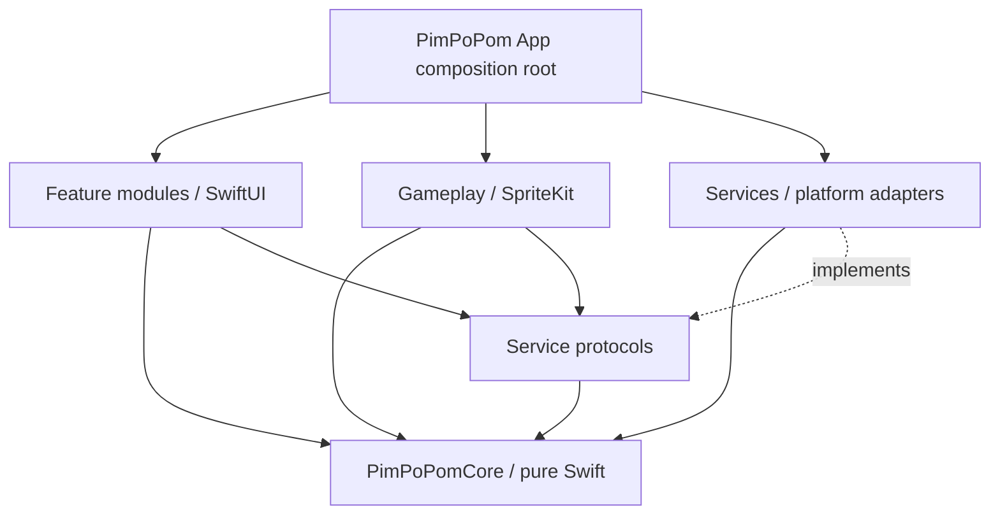

# Native architecture

## Goals

- Preserve deterministic rules while using native rendering, touch timestamps, audio, haptics, purchases, identity, and lifecycle APIs.
- Keep the reaction path free of networking, file I/O, decoding, analytics, ads, and actor hops that are not required for presentation.
- Make every server mutation idempotent and every external SDK replaceable behind an app-owned protocol.
- Support simulator development while treating physical-device evidence as mandatory for timing, audio, haptics, ads, and StoreKit.

## Dependency direction

`PimPoPomCore` has no outward dependency on Apple UI frameworks or infrastructure. Feature code depends on protocols; the app target injects live, preview, staging, or test implementations.

## Proposed modules

The playable alpha currently keeps Gameplay, Features, and Services as folders in the app target while their APIs stabilize; only `PimPoPomCore` is a separate package. The dependency rules below still apply. Split targets later only when the boundary pays for its build and maintenance cost.

| Module | Owns | Must not own |
| --- | --- | --- |
| `PimPoPomCore` | Modes, config, state machine, scoring, ratings, streak, decoys, injected RNG/time, proof events, snapshots | UI, timers, storage, network, audio, ads, purchases |
| `PimPoPomContracts` | Service-facing protocols, shared request/result models, capability abstractions | Live SDK clients, UI, server authority |
| `PimPoPomGameplay` | `SKScene`, node layout, animation, presentation callback, touch bridge, board accessibility proxy | Scoring, life loss, random choices, server submission |
| `PimPoPomFeatures` | App routes, menu, Arcade/Zen hosts, results, leaderboard, profile, settings, achievements, shops, paywalls | Authoritative balance, ledger, StoreKit verification |
| `PimPoPomServices` | API, auth, Keychain, StoreKit, ads/consent, audio, haptics, preferences, reachability hints, Game Center | Game rules, UI layout, client-authoritative value |
| `PimPoPomDesign` | Typography, colors, surfaces, spacing, theme/pet presentation contracts | Rules, prices, entitlements |

If separate Swift packages slow iteration, use framework targets with the same dependency boundaries first. Do not collapse boundaries just to reduce project files.

## State and concurrency

- One main-actor app coordinator owns navigation and feature presentation.
- A run coordinator owns one engine instance and serializes commands. The engine itself is synchronous, deterministic value/state logic.
- SpriteKit updates and UIKit touch callbacks stay on the main thread. Convert timestamps and issue engine commands immediately; schedule decoration afterward.
- Service clients use `async` APIs and isolated mutable state. Cancellation follows the screen/run lifecycle.
- A background transition atomically freezes local gameplay, abandons any issued ranked attempt when possible, silences audio/haptics, and prevents later queued input from resolving the old round.
- Never make a network request or await an actor before resolving a reaction touch.

## Timing model

1. The engine requests a target activation with a chosen cell, color, and absolute response window.
2. Gameplay constructs the target node before the presentation boundary.
3. On the render/update frame that makes it visible, Gameplay records a monotonic presentation timestamp and tells the engine the target is presented.
4. The input bridge uses the original compatible `UITouch.timestamp` and the same uptime timebase. It falls back to handler time only if a measured compatibility check fails.
5. Target expiry is an absolute deadline from presentation, not a new relative delay.
6. A single engine transition wins the expiry/input race. Input exactly at the deadline is late. Pre-presentation and already-resolved input is ignored without a second penalty.

Test on 60 Hz and 120 Hz hardware. `CADisplayLink`/SpriteKit callback time is still an approximation of pixel emission, and `UITouch.timestamp` is still an approximation of physical contact; do not claim photon-to-contact accuracy without external measurement.

## Rendering and layout

- SwiftUI owns safe areas, navigation, menus, shops, result screens, and the fixed bottom ad host.
- SpriteKit receives a stable gameplay viewport whose size does not change when an ad fills, fails, or is removed during a run.
- The board maps cells deterministically and disables interpolation or effects that make target boundaries ambiguous.
- Theme/pet visuals are data-driven presentation. The hit target and game semantics do not depend on texture pixels.
- Dynamic Type applies to app surfaces. The reaction board provides clear VoiceOver labels and an alternate interaction/accessibility strategy without introducing hidden automatic play.

## Platform services

- **Audio:** one app-owned audio service with independent Sound FX and Music buses using `AVAudioEngine`; bounded predecoded buffers, scene fades, interruption/route handling, and no-late-cue behavior.
- **Haptics:** a Core Haptics adapter with system-feedback fallback and a no-op implementation for unsupported devices, Simulator, or user opt-out.
- **Persistence:** `UserDefaults`/`AppStorage` only for nonsecret device preferences; Keychain for app sessions and sensitive identifiers; server for durable profile/economy.
- **Networking:** `URLSession`, `Codable`, environment-specific base URLs, explicit request IDs/idempotency keys, bounded retry policy, no silent production fallback.
- **Identity:** AuthenticationServices plus Google Sign-In behind an identity-provider protocol; exchange short-lived provider proof for an app session.
- **Purchases:** StoreKit 2 client plus server verification/notification path. The UI observes server-confirmed entitlement and balance.
- **Ads:** provider SDK behind `AdServing`, with consent, test/live configuration separation, no-fill handling, and a zero-network implementation for tests/previews.
- **Game Center:** optional social surface; a verified mirror uses server-bound Game Center identity and Apple's server API after PimPoPom acceptance. Client submission is auxiliary/unverified and never a prerequisite for local play.
- **Integrity:** App Attest challenge/assertion around selected sensitive server requests, with explicit unsupported/recovery policy.

## Configuration and environments

Use `Debug`, `Staging`, and `Release` configurations with committed `.xcconfig` examples. Inject only nonsecret identifiers into the app bundle. Private keys and server secrets never ship in the app.

Each configuration has an unmistakable API base URL, ad mode, StoreKit environment expectation, logging policy, attestation environment, and display suffix/icon treatment where appropriate. A release build fails closed if placeholder or test identifiers remain.

## Backend ownership

The iOS repository owns the client, contract fixtures, and compatibility expectations. It does not duplicate PHP server code. A backend change is implemented and deployed from the backend-owning repository, then the PimPoPom client is upgraded against staging. Both sides preserve older supported API/ruleset versions through a documented compatibility window.
