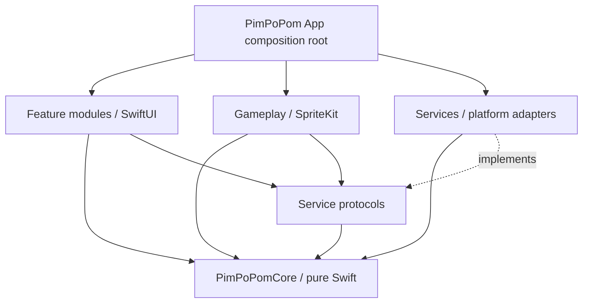

# Native architecture

## Goals

- Preserve deterministic rules while using native rendering, touch timestamps, audio, haptics, purchases, identity, and lifecycle APIs.
- Keep the reaction path free of networking, file I/O, decoding, analytics, ads, and actor hops that are not required for presentation.
- Make every server mutation idempotent and every external SDK replaceable behind an app-owned protocol.
- Support simulator development while treating physical-device evidence as mandatory for timing, audio, haptics, ads, and StoreKit.

## Dependency direction

`PimPoPomCore` has no outward dependency on Apple UI frameworks or infrastructure. Feature code depends on protocols; the app target injects live, preview, staging, or test implementations.

## Proposed modules

The playable alpha currently keeps Gameplay, Features, and Services as folders in the app target while their APIs stabilize; only `PimPoPomCore` is a separate package. The dependency rules below still apply. Split targets later only when the boundary pays for its build and maintenance cost.

| Module | Owns | Must not own |
| --- | --- | --- |
| `PimPoPomCore` | Modes, config, state machine, scoring, ratings, streak, decoys, injected RNG/time, proof events, snapshots | UI, timers, storage, network, audio, ads, purchases |
| `PimPoPomContracts` | Service-facing protocols, shared request/result models, capability abstractions | Live SDK clients, UI, server authority |
| `PimPoPomGameplay` | `SKScene`, node layout, animation, presentation callback, touch bridge, board accessibility proxy | Scoring, life loss, random choices, server submission |
| `PimPoPomFeatures` | App routes, menu, Arcade/Zen hosts, results, leaderboard, profile, settings, achievements, shops, paywalls | Authoritative balance, ledger, StoreKit verification |
| `PimPoPomServices` | API, auth, Keychain, StoreKit, ads/consent, audio, haptics, preferences, reachability hints, Game Center | Game rules, UI layout, client-authoritative value |
| `PimPoPomDesign` | Typography, colors, surfaces, spacing, theme/pet presentation contracts | Rules, prices, entitlements |

If separate Swift packages slow iteration, use framework targets with the same dependency boundaries first. Do not collapse boundaries just to reduce project files.

## State and concurrency

- One main-actor app coordinator owns navigation and feature presentation.
- A run coordinator owns one engine instance and serializes commands. The engine itself is synchronous, deterministic value/state logic.
- SpriteKit updates and UIKit touch callbacks stay on the main thread. Convert timestamps and issue engine commands immediately; schedule decoration afterward.
- Service clients use `async` APIs and isolated mutable state. Cancellation follows the screen/run lifecycle.
- A background transition atomically freezes local gameplay, abandons any issued ranked attempt when possible, silences audio/haptics, and prevents later queued input from resolving the old round.
- Never make a network request or await an actor before resolving a reaction touch.

## Timing model

1. The engine requests a target activation with a chosen cell, color, and absolute response window.
2. Gameplay constructs the target node before the presentation boundary.
3. On the render/update frame that makes it visible, Gameplay records a monotonic presentation timestamp and tells the engine the target is presented.
4. The input bridge uses the original compatible `UITouch.timestamp` and the same uptime timebase. It falls back to handler time only if a measured compatibility check fails.
5. Target expiry is an absolute deadline from presentation, not a new relative delay.
6. A single engine transition wins the expiry/input race. Input exactly at the deadline is late. Pre-presentation and already-resolved input is ignored without a second penalty.

Test on 60 Hz and 120 Hz hardware. `CADisplayLink`/SpriteKit callback time is still an approximation of pixel emission, and `UITouch.timestamp` is still an approximation of physical contact; do not claim photon-to-contact accuracy without external measurement.

## Rendering and layout

- SwiftUI owns safe areas, navigation, menus, shops, result screens, and the fixed bottom ad host.
- SpriteKit receives a stable gameplay viewport whose size does not change when an ad fills, fails, or is removed during a run.
- The board maps cells deterministically and disables interpolation or effects that make target boundaries ambiguous.
- Theme/pet visuals are data-driven presentation. The hit target and game semantics do not depend on texture pixels.
- Dynamic Type applies to app surfaces. The reaction board provides clear VoiceOver labels and an alternate interaction/accessibility strategy without introducing hidden automatic play.

## Platform services

- **Audio:** one app-owned audio service with independent Sound FX and Music buses using `AVAudioEngine`; bounded predecoded buffers, scene fades, interruption/route handling, and no-late-cue behavior.
- **Haptics:** a Core Haptics adapter with system-feedback fallback and a no-op implementation for unsupported devices, Simulator, or user opt-out.
- **Persistence:** `UserDefaults`/`AppStorage` only for nonsecret device preferences; Keychain for app sessions and sensitive identifiers; server for durable profile/economy.
- **Networking:** `URLSession`, `Codable`, environment-specific base URLs, explicit request IDs/idempotency keys, bounded retry policy, no silent production fallback.
- **Identity:** an app-owned identity-provider boundary exchanges short-lived provider proof for an app session. Google Sign-In is the only implemented provider today; Sign in with Apple requires the accepted multi-provider backend/linking and deletion flow before its native AuthenticationServices button can ship.
- **Purchases:** StoreKit 2 client plus server verification/notification path. The UI observes server-confirmed entitlement and balance.
- **Ads:** provider SDK behind app-owned `ConsentServing`/`AdsServing` protocols and one main-actor `AdsController`, with consent, authoritative server ad-free gating, test/live configuration separation, no-fill handling, persistent interstitial cadence, and zero-network fakes for tests/previews.
- **Game Center:** explicit optional social surface. `GameCenterService` installs `GKLocalPlayer` authentication only after a Profile opt-in and owns Apple-controller presentation, persistent-scoped-ID validation, and ephemeral identity-verification material. `BackendClient` owns the cookie/CSRF challenge, exact proof/link request, additive server status, reauthentication restart, and publication-disable request. PHP owns one-to-one identity binding, explicit publication consent, prerelease/production routing, idempotent score/achievement backfill and retry, and every Apple write. The client never submits scores or achievements directly; Game Center is never a prerequisite for local play or another service, and Apple exposes no app-level Game Center sign-out API.
- **Integrity:** App Attest challenge/assertion around selected sensitive server requests, with explicit unsupported/recovery policy.

### Current internal-alpha implementations

- `BackendClient` coalesces session bootstrap and uses session/player generations so a superseded request cannot replace a newer login, logout, or account profile.
- `AchievementsController` owns only native loading, claim progress, error copy, menu summary, and theme-aware presentation state. It resets on account identity changes and rejects stale responses; the PHP catalog, unlock state, rewards, idempotency, and coin balance remain authoritative.
- `CosmeticsController` merges public catalog reads with authenticated server profiles, but never computes authoritative prices, purchases, ownership, or balance. It serializes all economy mutations across both shops. Signed-out local selection is limited to the two always-free theme IDs.
- `ThemePalette` and `PetPresentation` map stable backend IDs to native presentation only. The backend alone supplies the special-pet override. Pancake uses the retained native replacement sprite/floor while its price, ownership, selection, and visibility remain server-authoritative.
- `AudioController` owns one `AVAudioEngine` with independent Sound FX/Music mixer buses. It lazy-decodes only enabled categories, keeps shared loss/sting buffers across enabled theme swaps, rejects stale loads, routes menu/gameplay/silent contexts, and stops immediately on background/interruption.
- `AppPreferences` stores only nonsecret local audio values, the glyph toggle, and the signed-out free-theme choice in `UserDefaults`.
- `GameCenterService` installs GameKit authentication independently of `BackendClient`, exposes truthful status/retry to Profile, and suppresses system UI under deterministic UI tests. It does not persist player identifiers or signature material and has no path to alter PimPoPom identity, results, achievements, coins, cosmetics, or StoreKit state.
- StoreKit 2 is implemented behind an app-owned actor/protocol and one app-wide purchase controller. Production submits only a locally verified transaction JWS plus the current server-issued `appAccountToken`, accepts only a strictly validated authoritative wallet/entitlement response, and finishes the transaction afterward. A Debug-only local scheme combines real local StoreKit transactions with an offline fake credit service; it cannot call Hostinger.
- `AdsController` starts only after `BackendClient` completes session restoration. `nil`/malformed entitlement state fails closed, signed-out resolved sessions and authenticated `adFree == false` may enter UMP, and authenticated `adFree == true` tears down GMA without consulting coins or StoreKit-local state. Google types remain inside `GoogleConsentService`/`GoogleAdsService`; gameplay emits only an app-local completion UUID. An ad-supported run freezes a 50-point footer below the Speed Bar for geometry stability and may attach the one fixed banner there; menu/results rehost that same banner. Disabled or already ad-free sessions construct neither an ad surface nor a spacer. A versioned `UserDefaults` record stores only the completion cadence and recent UUIDs, never an advertising identifier or consent decision.

## Configuration and environments

Use `Debug`, `Staging`, `OwnerAdsQA`, and `Release` configurations. The first named-cohort Staging configuration is release-optimized but intentionally points to the same P-027 Hostinger compatibility service because no separate native staging backend exists; it must not be mistaken for data isolation. Debug uses Google demo inventory. The explicitly accepted owner-split Staging candidate compares committed SHA-256 fingerprints for the owner's cable and TestFlight IDFVs locally to select the committed owner production units plus that phone's GMA test-device ID; a missing/nonmatching identifier selects demo units and no custom test-device ID. An exact owner production no-fill may make one bounded request with the configured official demo fallback; official demo inventory does not require clearing the owner test-device registration. The raw IDFV is emitted only when the process is deliberately launched with `--ad-diagnostics`; it is not transmitted through PimPoPom. Owner Ads QA retains the cable-only path. Checked-in Release is disabled; a separately controlled, explicitly authorized archive supplies live units and no test identifier. AdMob application/unit identifiers are public configuration; private keys and server secrets never ship in the app.

Each configuration has an unmistakable API base URL, ad mode, StoreKit environment expectation, logging policy, attestation environment, and display suffix/icon treatment where appropriate. A release build fails closed if placeholder or test identifiers remain.

## Backend ownership

The iOS repository owns the client, contract fixtures, and compatibility expectations. It does not duplicate PHP server code. A backend change is implemented and deployed from the backend-owning repository, then the PimPoPom client is upgraded against staging. Both sides preserve older supported API/ruleset versions through a documented compatibility window.
